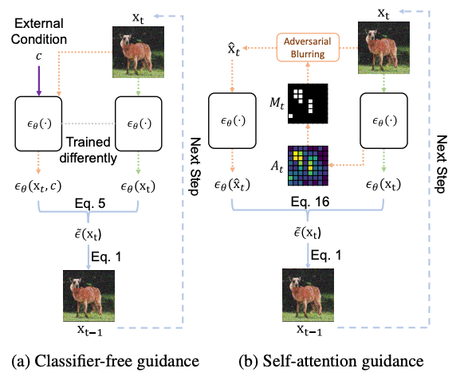
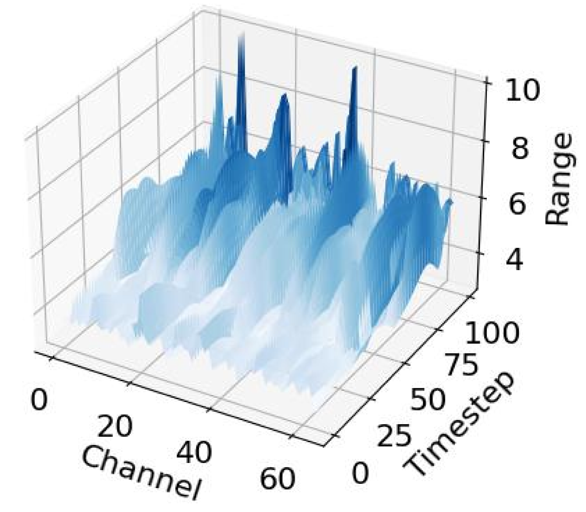

# TinyDM

[](LICENSE)
[](https://github.com/username/project/actions)
[](https://codecov.io/gh/username/project)
[](https://www.npmjs.com/package/project)

## Overview

This is a pytorch implementation of the paper "tinyDM: A Tiny and Accurate Diffusion Model for High-Quality Image Generation".


## Features

- **Key Feature One**: Self Attention mechanism in quantisation.
When quantizing diffusion models (reducing their precision from 32-bit or 16-bit floating point to lower bit representations eg 8-bit or 4-bit), the challenge is maintaining the complex relationships between features that the model has learned.


- **Key Feature Two**: Channel Wise Balancing Quantisation.
 Channel-wise Linear Quantization normally is treated as a baseline for naive PTQ methods. Involves quantizing each channel independently, without considering the inter-channel relationships or analysing the ranges of activation values across all time steps in DDIM on CIFAR-10, LDM on LSUN-Bedroom and LSUN-Church


## Prerequisites

- python>=3.8
- pytorch>=1.12.1
- torchvision>=0.13.0 
- other packages like numpy, tqdm and math

## Installation

Step-by-step installation instructions:


## Clone the repository
```bash
git clone https://github.com/aqilmarwan/tinyDM.git
cd tinyDM
```

## Configure environment variables from LDM

## Usage

### Basic Examples

### Training and Testing

The following experiments were performed in NVIDIA A500 with 24GB memory.

### Generate CIFAR-10 Images

You can run the following command to generate 50000 CIFAR-10 32*32 images in low bitwidths with differentiable group-wise quantization and active timestep selection.

```
sh sample_cifar.sh
```

### Calculate FID

After generation, you can run the following command to evaluate IS and FID.

```
python -m pytorch_fid <dataset path> <image path>
```

## Performance

Performance was conducted on NVIDIA A500 with 24GB memory with specified quantisation parameters settings.

## Class-conditional Image Generation
**Dataset:** ImageNet 256 × 256  

| Timesteps | Bit-width (W/A) | Method        | Size (MB) | FID ↓ | sFID ↓ | IS ↑ | Precision ↑ |
|-----------|----------------|--------------|-----------|-------|--------|------|------------|
| 250       | 32/32          | `FP`         |           |       |        |      |            |
|           | 8/8            | `Q-Diffusion` |           |       |        |      |            |
|           |                | `PTQD`        |           |       |        |      |            |
|           |                | `PTQ4DM`      |           |       |        |      |            |
|           |                | **`TinyDM`**  |           |       |        |      |            |
|           | 4/8            | `Q-Diffusion` |           |       |        |      |            |
|           |                | `PTQD`        |           |       |        |      |            |
|           |                | `PTQ4DM`      |           |       |        |      |            |
|           |                | **`TinyDM`**  |           |       |        |      |            |
| 50        | 32/32          | `FP`         |           |       |        |      |            |
|           | 8/8            | `Q-Diffusion` |           |       |        |      |            |
|           |                | `PTQD`        |           |       |        |      |            |
|           |                | `PTQ4DM`      |           |       |        |      |            |
|           |                | **`TinyDM`**  |           |       |        |      |            |
|           | 4/8            | `Q-Diffusion` |           |       |        |      |            |
|           |                | `PTQD`        |           |       |        |      |            |
|           |                | `PTQ4DM`      |           |       |        |      |            |
|           |                | **`TinyDM`**  |           |       |        |      |            |

---

## Unconditional Image Generation
**Dataset:** LSUN-Bedrooms 256 × 256 LDM4  

| Timesteps | Bit-width (W/A) | Method        | Size (MB) | FID ↓ | sFID ↓ | IS ↑ | Precision ↑ |
|-----------|----------------|--------------|-----------|-------|--------|------|------------|
| 250       | 32/32          | `FP`         |           |       |        |      |            |
|           | 8/8            | `Q-Diffusion` |           |       |        |      |            |
|           |                | `PTQD`        |           |       |        |      |            |
|           |                | `PTQ4DM`      |           |       |        |      |            |
|           |                | **`TinyDM`**  |           |       |        |      |            |
|           | 4/8            | `Q-Diffusion` |           |       |        |      |            |
|           |                | `PTQD`        |           |       |        |      |            |
|           |                | `PTQ4DM`      |           |       |        |      |            |
|           |                | **`TinyDM`**  |           |       |        |      |            |


## Image Synthesis Generation

## Roadmap
Current state of the project:

- [x] Results on state of the conditional. (current)
- [x] Results on un-conditional image benchmarking. (current)
- [x] Self attention mechanism in PTQ diffusion models
- [x] Dissertation writing of 3401 words.

Future possible/uncomplete plans for the project:

- [x] Explore Channel Wise Balancing Quantisation.
- [ ] Performance metrics
  - [ ] Quantisation Error Analysis (MSE, MAE, etc)
  - [ ] Performance w.r.t. different timestep sampling strategies for calibration set construction(time-step selection)
  - [ ] Image synthesis/comparison on datasets. (LSUN Church, LSUN Bedroom, CIFAR-10 etc)
  - [ ] Performance w.r.t Sampling Strategies
  - [ ] Performance w.r.t. different quantisation methods.

## License

This project is licensed under the MIT License - see the [LICENSE](LICENSE) file for details.

## Acknowledgements

- [DDIM](https://github.com/ermongroup/ddim)
- [DDPM](https://github.com/hojonathanho/diffusion)
- [Stable Diffusion](https://github.com/Stability-AI/stablediffusion)
- [PTQ4DM](https://github.com/42Shawn/PTQ4DM)
- [Q-diffusion](https://github.com/Xiuyu-Li/q-diffusion)
- [guided-diffusion](https://github.com/openai/guided-diffusion)
- [Self-Attention-Guidance](https://github.com/SusungHong/Self-Attention-Guidance)
